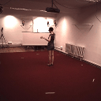
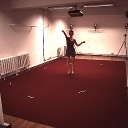
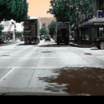
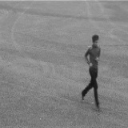
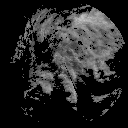
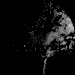
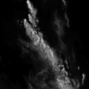
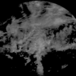
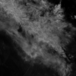

# GS2PM: A Large Spatiotemporal Predictive Model for Predicting Future Sequences

This is the official implementations of GS2PM. The training pipeline of GS2PM is as 


Inspired recent success in large vision models, masked modeling and visual prompts, this model takes previous spatiotemporal sequences and predict future frames across diverse domains. 


**🍇 Updates**
- **`xx`** Please wait for our future support.
- **`2024/07/28`** Release code, scripts, pre-trained weights and data for reproducing traning and testing. 

### Install via conda yaml file (cuda 11.3)
```bash
conda env create -f environment2.yml
conda activate BPN
```

## 1. Data Preparation
Download the data collection we used from the [website](https://pan.baidu.com/s/1kVzgZC6YTgewR-VBLrvDJw?pwd=4a1m)
The downloaded `.zip` files are ready for unzipping in the `data` folder. The unzipped
data in the folder should be like this format:

```bash
data
└─train
    ├─bair
        ├─sample1
        ├─sample2
        ├─...
    ├─hko
    ├─human
    ├─...
└─test
    ├─bair
    ├─hko
    ├─human
    ├─...
```

The data source is from 8 datasets, the details are given as


|  Collections  |        Num. Seq. (20 figs/seq)        |                                         Simplified Dscrtiption                                          |                                               Data                                                |
|:-------------:|:-------------------------------------:|:-------------------------------------------------------------------------------------------------------:|:-------------------------------------------------------------------------------------------------:|
|     BAIR      |  475,904 (Train) /<br/> 2816 (Test)   |                      Robotic arm randomly grabs <br/>objects in the static scene.                       |                  |
|     Human     |  73,404 (Train) /<br/> 8,582 (Test)   |                                 Human actions with complex <br/>poses.                                  |                |
| KittiCaltech  |  2,042 (Train) /<br/> (3,095) (Test)  |                          Scenes including dynamics of driving <br/>scenarios.                           |  |    
|      KTH      |   8,488 (Train) /<br/> 5,041 (Test)   |  Human actions including walking, jogging, <br/>running, boxing, <br/>hand waving, and hand clapping.   |                    |   
| Moving-Mnist  |  10,000 (Train) /<br/> 10,000 (Test)  |                          Each video sequence comprises <br/>two moving digits.                          |   |   
|     HKO-7     |  31,551 (Train) /<br/> 5,851 (Test)   |                     The radar echoes of Hong Kong, <br/>from 2011 to 2013.                              |               |   
| Shanghai2020  | 33,000 (Train) /<br/> 5,000 (Test)    |                                 Radar echoes of Shanghai,<br/> in 2020.                                 |      |   
|   Sevir-VIL   |   7,624 (Train) /<br/> 2,542 (Test)   | Radar echoes collected by collected by the <br/>National Weather Service (NWS),<br/> from 2017 to 2019. |         |   

The training set for training our versions of GS2PM contains the all training part of these datasets.


## 3. Predicting future frames with pretained GS2PM
To generate the results, the pre-trained [weights](https://pan.baidu.com/s/1CA7JqkyNFuatjO2ihVSi7w?pwd=u9n5) 
should be downloaded and placed in `save_models` folder. Specifically, `GS2PM-Large.pth`
is the largest version of trained weights, and `GS2PM-Medium.pth` is the medium scale and `GS2PM-Tiny.pth` is the smallest.

The scale of these versions are 


| Scale  | Batch size | Num. N | Hidden Dim. | T-head | Epochs | Params  |  FlOPs  |     Size      | T-Length |
|:------:|:----------:|:------:|:-----------:|:------:|:------:|:-------:|:-------:|:-------------:|:--------:|
| Small  |     8      |   8    |     128     |  128   |   1    | 10.34M  | 20.89G  |    128x128    |  10-10   |
| Medium |     8      |   32   |     384     |  384   |   1    | 99.84M  | 120.42G |    128x128    |  10-10   |
| Large  |     8      |   64   |     512     |  512   |   1    | 441.80M | 470.32G |    128x128    |  10-10   |


For running with pretrained versions with general prompts, the setting of `configs.py` is needed at first.

```bash
"""setting running mode"""
mode = 'test'
model = 'MS2Pv3'
dataset_type = 'pam'
pretrained_model = '{the path to pretrained parameters}}'
domain = 'shanghai2020'  # choose one: domains = ['bair', 'hko7', 'human', 'kitticaltech', 'kth', 'moving_mnist', 'sevir-vil', 'sevir-vis', 'shanghai2020']
```

Then run 

```bash
python main_scratch.py
```

It is recommended to specify the GPU device number, by specifying in `configs.py`, like

```bash
device_ids_eval = [0]
```

From the results of pre-trained models, the scaling effects can be observed.


This is the case on Shanghai2020 dataset, other cases can be found in our Supplementary Figs attached with the paper.

## 4. Predict with tuned versions of GS2PM on 8 downstream datasets

To generate the results, the released tuned parameters are available at [weights](https://pan.baidu.com/s/1f2TXUJWU6eTSGh265PS_cA?pwd=0vp5) 
should be downloaded and placed in `save_models` folder. Specifically, `GS2PM-VP.pth`
is the visual prompted version and `GS2PM-VP.pth` is tuned by full-parameter manner. Pretrained weights are stored by different folders with 
names of downstream data. The recommended placement is  

```bash
data
└─save_models
    ├─bair
        ├─GS2PM-VP.pth
        ├─GS2PM-FP.pth
    ├─hko
    ├─human
    ├─...
```

For running with tuned versions, the setting of `configs.py` is needed.

```bash
"""setting running mode"""
mode = 'test'
model = 'MS2Pv3_tune'
dataset_type = 'pam'
pretrained_model = '{the path to pretrained parameters}}'
domain = 'shanghai2020'  # choose one: domains = ['bair', 'hko7', 'human', 'kitticaltech', 'kth', 'moving_mnist', 'sevir-vil', 'sevir-vis', 'shanghai2020']
```

Then run

```bash
python main_scratch.py
```


## 5. Training

The training of all versions contain two stages, one is pretraining and another is fine-tuning. For pretraining, the setting of `configs.py` is needed.

```bash
"""setting running mode"""
mode = 'train'
model = 'MS2Pv3'
dataset_type = 'pam'
```

Then run

```bash
python main_scratch.py
```

This will pretrain our GS2PM with pretrained versions, the scale please specify in code by yourself or please wait for our updates. 

To tune on specific downstream datasets, the setting of `configs.py` is also needed.

```bash
"""setting running mode"""
mode = 'train'
model = 'MS2Pv3_tune'
dataset_type = 'pam'
fine_tune = True    # please specify this
pretrained_model = '{the path to pretrained parameters}}'   # and the path of pre-trained weights
domain = 'shanghai2020'   # specify specific domain
```

By running

```bash
python main_scratch.py
```

The tuned versions will be saved by `model_save_dir`.

The results of tuned models with comparison to SOTAs are as 

The resuts on BAIR:

| U-Net	 | PredRNN |	PredRNN++| 	ConvLSTM  | 	MotionRNN  |	SimVP|	SimVPv2| 	GS2PM-Pre | 	GS2PM-VP | 	GS2PM-FT |
|:------:|:-------:|:------:|:----------:|:-----------:|:------:|:-------:|:----------:|:---------:|:---------:|
| MSE 	  |  0.053  |	1.210	|   0.055	   |   0.052	    |0.051	|0.053	|  0.053	    |  0.089	   |  0.089	   |0.091|
| PSNR 	 |  20.38  |	5.76	| 20.14      |   	20.61	   |20.72	|20.19	|   20.26	   |  21.44	   |  21.47	   |21.54|
| SSIM 	 |  0.854  |	0.123	|   0.846    |   	0.860	   |0.861	|0.840	|   0.848	   |  0.875	   |  0.877	   |0.876|
| LPIPS  | 	0.037  |	0.516	|   0.035	   | 0.035       |	0.035	|0.042|   	0.043   | 	0.037 	  |  0.037 	  |0.038|

On Human3.6M:

| U-Net	  | PredRNN  | 	PredRNN++ | 	ConvLSTM | 	MotionRNN  |	SimVP|	SimVPv2| 	GS2PM-Pre | 	GS2PM-VP | 	GS2PM-FT |
|:-------:|:--------:|:----------:|:---------:|:-----------:|:------:|:-------:|:----------:|:---------:|:---------:|
| MSE 	   | 0.018    |  	0.018	   |  0.017	   |0.016	|0.016	|0.016	|0.017	|0.017	|0.014|
| PSNR 	  |  30.04   |  	30.28    |  	30.34   |	30.84|	30.99|	30.37|	30.47|	29.45|	29.57|	31.39|
| SSIM 	  |  0.953   |   	0.954   |  	0.953   |	0.957|	0.958|	0.953|	0.955|	0.940|	0.943|	0.963|
|  LPIPS  |  	0.034  |   	0.029   |  	0.030   |	0.028|	0.029|	0.034|	0.035|	0.040|	0.040|	0.025|

Other results can be found in Supplementary Data attached with our paper or waiting our updating.


## Citation
```

```

## Contact 

Please feel free to contact us through issues and the correspondence is our paper.

